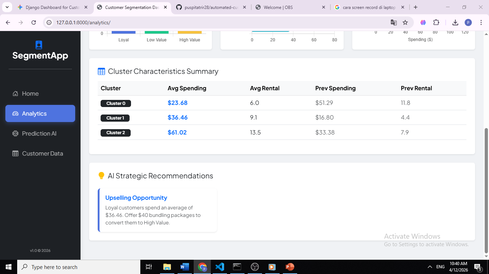

# 📊 Automated Customer Segmentation Dashboard
This project is a web-based dashboard for **Customer Behavior Analysis** and **Automated Segmentation** using Machine Learning. Built as part of the Advanced Database Final Project.

## 🚀 Features
- **Predictive Modeling**: Real-time customer segmentation using K-Means Clustering.
- **Data Analytics**: Interactive visualization of customer distributions and spending trends.
- **Database Integration**: Robust data management with PostgreSQL/SQLite.
- **Modern UI**: Clean, responsive dashboard with loading states and animations.

---

## 📸 Project Preview

### 🏠 Prediction & Machine Learning
*Input customer metrics (Spending, Frequency) to get instant segmentation results.*

| Before Analysis | Analyzing State | AI Result |
| :---: | :---: | :---: |
|  | (Loading Effect) |  |

### 📈 Analytics & Insights
*Visualizing customer clusters and data trends for business decision-making.*




### 👥 Customer Data Management
*Detailed view of all analyzed customers and their historical records.*


---

## 🛠️ Tech Stack
- **Backend**: Python (Django Framework)
- **Database**: PostgreSQL / SQLite3
- **Data Science**: Scikit-Learn (K-Means), Pandas, NumPy
- **Frontend**: HTML5, CSS3 (Bootstrap 5), JavaScript

---

## ⚙️ Installation & Setup
1. Clone the repository:
   ```bash
   git clone [https://github.com/puspitatrir28/automated-customer-segmentation.git](https://github.com/username/automated-customer-segmentation.git)
Developed with ❤️ by Puspita Tri Rahayu