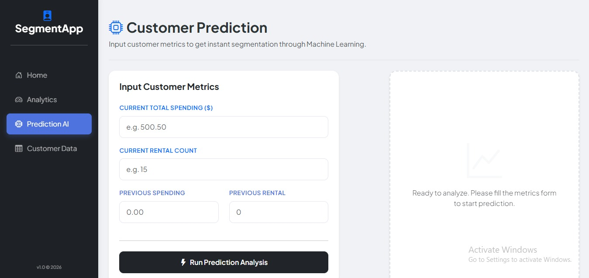
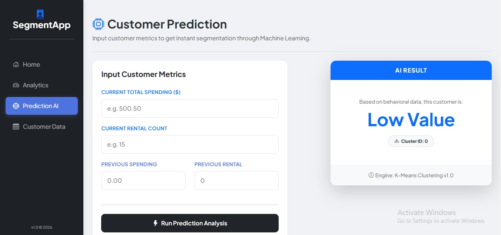
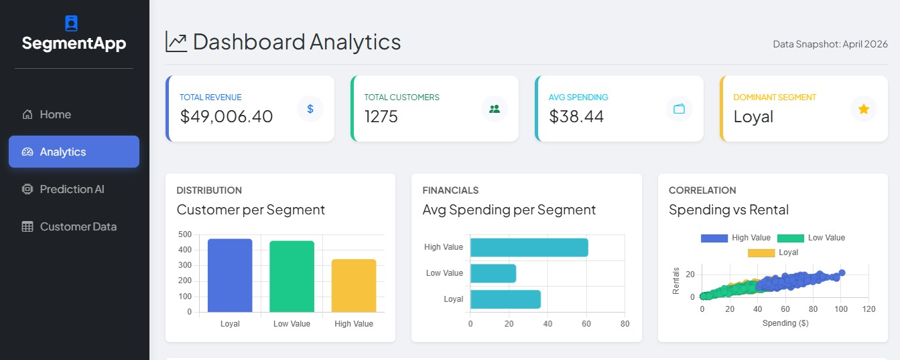
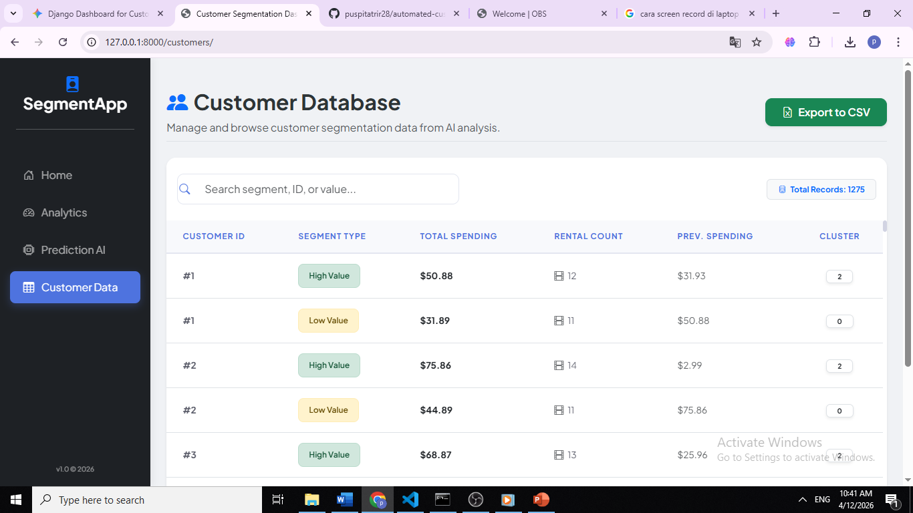

# 📊 Automated Customer Segmentation Dashboard
Proyek ini adalah dashboard berbasis web untuk **Analisis Perilaku Pelanggan** dan **Segmentasi Otomatis** menggunakan Algoritma K-Means Clustering. Dibuat sebagai proyek akhir mata kuliah Advanced Database.

---

## 📸 Project Preview

### 🏠 Prediction & Machine Learning
*Input metrik pelanggan (Spending, Frequency) untuk mendapatkan hasil segmentasi instan.*

| Input Form | Prediction Result |
| :---: | :---: |
|  |  |

### 📈 Analytics & Insights
*Visualisasi distribusi cluster pelanggan untuk pengambilan keputusan bisnis.*



### 👥 Customer Data Management
*Riwayat lengkap data pelanggan yang telah dianalisis.*



---

## 📁 Folder Structure
```text
automated-customer-segmentation/
├── assets/                     # Folder untuk screenshot & aset dokumentasi
├── customersegmentation_prediction/
│   ├── static/                 # File CSS, JS, dan Gambar
│   ├── templates/              # File HTML (Form, Analytics, Data)
│   ├── views.py                # Logika Bisnis & Proses AI
│   └── models.py               # Skema Database
├── customersegmentation_project/
│   ├── settings.py             # Konfigurasi aplikasi & Database
│   └── urls.py                 # Routing Utama
├── manage.py                   # Django Manager
├── requirements.txt            # Daftar library Python yang dibutuhkan
└── .gitignore                  # Daftar file yang tidak di-upload ke GitHub
🚀 Key Features
Real-time Prediction: Segmentasi pelanggan langsung (High Value, Loyal, Low Value).

Interactive Analytics: Grafik distribusi cluster yang informatif.

Session History: Penyimpanan otomatis setiap sesi analisis ke database.

Modern UI: Tampilan responsif dengan efek loading overlay.

🛠️ Tech Stack
Backend: Python (Django Framework)

Database: PostgreSQL / SQLite3

Data Science: Scikit-Learn (K-Means), Pandas, NumPy

Frontend: Bootstrap 5, JavaScript, CSS3

⚙️ How to Run This Project
1. Persiapan
Pastikan sudah terinstall Python 3.10+

Pastikan server PostgreSQL sudah aktif (jika menggunakan Postgres)

2. Instalasi
Clone repository ini:

Bash
git clone [https://github.com/username/automated-customer-segmentation.git](https://github.com/username/automated-customer-segmentation.git)
cd automated-customer-segmentation
Buat dan aktifkan Virtual Environment:

Bash
python -m venv myenv
# Untuk Windows:
myenv\Scripts\activate
Install semua library:

Bash
pip install -r requirements.txt
3. Konfigurasi Database
Sesuaikan pengaturan database di file customersegmentation_project/settings.py pada bagian DATABASES.

4. Jalankan Migrasi & Server
Bash
python manage.py migrate
python manage.py runserver
Buka di browser: http://127.0.0.1:8000/


### **Langkah setelah Copy-Paste:**
1. **Save** file `README.md`-nya.
2. Di terminal VS Code, ketik perintah ini untuk update ke GitHub:
   ```bash
   git add README.md
   git commit -m "Final update README with all sections merged"
   git push origin main